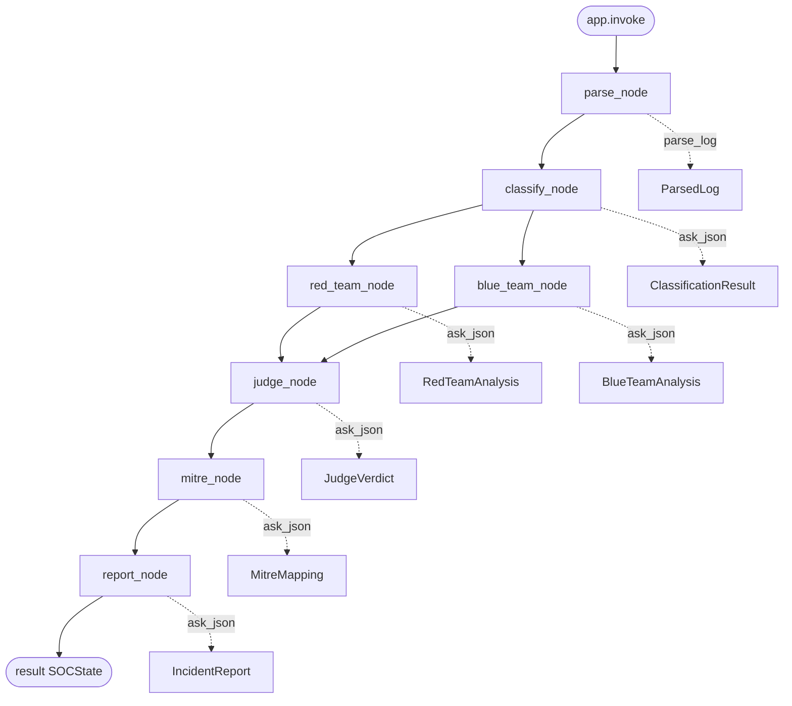

# AI SecOps Multi-Agent Log Analyzer

WAF/EDR 보안 로그를 **LangGraph 멀티에이전트 파이프라인**으로 분석해, 공격 여부·TP/FP 판정·MITRE 매핑·인시던트 리포트까지 자동 생성하는 프로젝트입니다.

```
WAF/EDR Log → Parser → Classifier → [Red Team ∥ Blue Team] → Judge → MITRE → Report
```

## 문제 정의

SOC 환경에서는 WAF·EDR 알람이 대량으로 발생하고, 단일 LLM 분류만으로는 **오탐(FP)** 과 **근거 부족** 문제가 있습니다.  
본 프로젝트는 Red/Blue adversarial 분석과 Judge 종합 판정을 결합해, **판정 결과와 함께 최종 판단 근거(`final_rationale`)** 를 함께 출력합니다.

## 아키텍처



| 노드 | State 읽기 | 호출 함수 | State 반환 |
|------|-----------|----------|-----------|
| `parse_node` | `raw_log`, `log_type` | `parse_log()` | `parsed_log` |
| `classify_node` | `parsed_log` | `ask_json(..., ClassificationResult)` | `classification` |
| `red_team_node` | `parsed_log`, `classification` | `ask_json(..., RedTeamAnalysis)` | `red_team` |
| `blue_team_node` | `parsed_log`, `classification` | `ask_json(..., BlueTeamAnalysis)` | `blue_team` |
| `judge_node` | `parsed_log`, `classification`, `red_team`, `blue_team` | `ask_json(..., JudgeVerdict)` | `verdict` |
| `mitre_node` | `parsed_log`, `verdict` | `ask_json(..., MitreMapping)` | `mitre` |
| `report_node` | `parsed_log`, `verdict`, `mitre` | `ask_json(..., IncidentReport)` | `incident_report` |

상세 플로우차트(PDF/PNG): [`docs/AI_SecOps_Flowchart.pdf`](docs/AI_SecOps_Flowchart.pdf)

## 주요 기능

- **LLM 없는 Parser** — 로그 정규화, IP/URL IOC 추출, WAF/EDR 자동 판별
- **1차 Classifier** — 공격 여부·유형·confidence 1차 분류
- **Red / Blue 병렬 분석** — 공격 가설 vs 정상/오탐 가설을 동시에 수집
- **Judge + 최종 판단 근거** — Red/Blue를 종합해 `verdict`, `tp_fp`, `final_rationale` 출력
- **MITRE ATT&CK 매핑** — technique ID, severity, 권고사항
- **인시던트 리포트** — executive summary + markdown 리포트
- **구조화 출력** — Pydantic 스키마 + `with_structured_output` + JSON 파싱 폴백(json5, json-repair)

## 기술 스택

| 구분 | 기술 |
|------|------|
| Orchestration | LangGraph (`StateGraph`) |
| LLM | Gemini / OpenAI / Mock |
| Schema | Pydantic v2 |
| Notebook | Jupyter (Colab 호환) |
| Dataset | [notesbymuneeb/ai-waf-dataset](https://huggingface.co/datasets/notesbymuneeb/ai-waf-dataset) |

## 프로젝트 구조

```
AI-secops/
├── AI_SecOps.ipynb          # Colab용 메인 노트북 (LangGraph 전체)
├── README.md
├── docs/
│   ├── AI_SecOps_Flowchart.pdf      # Node/State/Function 플로우차트
│   ├── AI_SecOps_Flowchart.png
│   └── generate_flowchart.py
└── test_data/
    ├── secops_core.py       # 파이프라인 코어 (노트북·테스트 공용)
    ├── run_validation.py    # 배치 검증 (100 → 10 샘플)
    ├── ai_waf_dataset_full.json
    ├── waf_sample_10.json
    └── TEST_REPORT.md
```

## 빠른 시작

### 1. 의존성

```bash
pip install langgraph langchain langchain-openai langchain-google-genai pydantic json5 json-repair
```

### 2. Mock 모드 (API 키 없이 파이프라인 검증)

```bash
cd test_data
LLM_PROVIDER=mock python3 run_validation.py
```

Mock 모드는 **파이프라인 연결·에러 없음**을 검증합니다. 레이블 정확도 평가는 Gemini/OpenAI 사용을 권장합니다.

### 3. Python에서 단건 실행

```python
from secops_core import analyze

result = analyze(
    {
        "source": "aws-waf",
        "action": "BLOCK",
        "http_method": "GET",
        "uri": "/api/users?id=1' UNION SELECT username,password FROM admin--",
        "client_ip": "203.0.113.45",
        "message": "SQL injection blocked",
    },
    log_type="waf",
)

v = result["verdict"]
print(v.verdict, v.tp_fp, v.confidence)
print(v.final_rationale)
```

### 4. Gemini / OpenAI

```bash
export LLM_PROVIDER=gemini   # 또는 openai
export GOOGLE_API_KEY=your_key   # gemini
# export OPENAI_API_KEY=your_key  # openai
```

Colab에서는 `AI_SecOps.ipynb` 환경 설정 셀에서 `LLM_PROVIDER`를 선택하고, API 키는 **Colab Secrets** 또는 환경 변수로 주입하세요. 키를 코드/노트북에 하드코딩하지 마세요.

### 5. 노트북 (Colab)

1. `AI_SecOps.ipynb` 업로드 또는 GitHub에서 열기
2. pip 설치 셀 실행
3. `LLM_PROVIDER` 설정
4. Model → State → Node → Graph 셀 순서대로 실행
5. 마지막 실행 셀:

```python
result = app.invoke({"raw_log": WAF_LOG, "log_type": "waf"})
```

## 출력 예시

```
【최종 판정】 ATTACK (TP)  |  confidence=78%

【최종 판단 근거】 (Judge LLM 분석)
Red Team은 로그에서 공격 패턴(의심 페이로드·비정상 URI)을 ...
Blue Team은 오탐·정상 트래픽 가능성을 제시했으나 ...
따라서 본 이벤트는 실제 공격(TP)으로 판단합니다.
```

## 검증 결과

| 항목 | 결과 |
|------|------|
| 파이프라인 배치 실행 (mock, 100건) | 100/100 OK |
| 파이프라인 배치 실행 (mock, 10건) | 10/10 OK |
| LangGraph 7단계 완료 | 정상 |
| Judge `final_rationale` 출력 | 정상 |

자세한 테스트 내역: [`test_data/TEST_REPORT.md`](test_data/TEST_REPORT.md)

> MockLLM은 키워드 휴리스틱 기반이라 **레이블 정확도 평가용이 아닙니다.** 실제 TP/FP 성능은 Gemini/OpenAI로 측정하세요.

## 설계 포인트

1. **Parser는 LLM 제외** — IOC 추출·정규화는 규칙 기반으로 고정해 비용·재현성 확보
2. **Red/Blue 병렬** — LangGraph `Parallelization` 패턴으로 상반된 가설을 동시에 수집
3. **Judge as Evaluator** — Evaluator-Optimizer 패턴으로 최종 TP/FP 및 근거 생성
4. **Pydantic + structured output** — Agent 간 계약을 스키마로 고정, Gemini JSON 파싱 오류는 json5/json-repair로 보완

## 한계 & 향후 개선

- [ ] Hugging Face Space / Streamlit 데모 UI
- [ ] EDR 로그 평가 데이터셋 확장
- [ ] Judge 판정 vs ground truth 벤치마크 (Gemini 기준)
- [ ] FastAPI 엔드포인트 (실시간 로그 ingest)
- [ ] MITRE 매핑 RAG (공식 technique description 연동)

## 라이선스

MIT (예정 — 배포 시 명시)

## 참고

- LangGraph 패턴: Prompt Chaining + Parallelization + Evaluator-Optimizer
- WAF 데이터셋: [notesbymuneeb/ai-waf-dataset](https://huggingface.co/datasets/notesbymuneeb/ai-waf-dataset)
